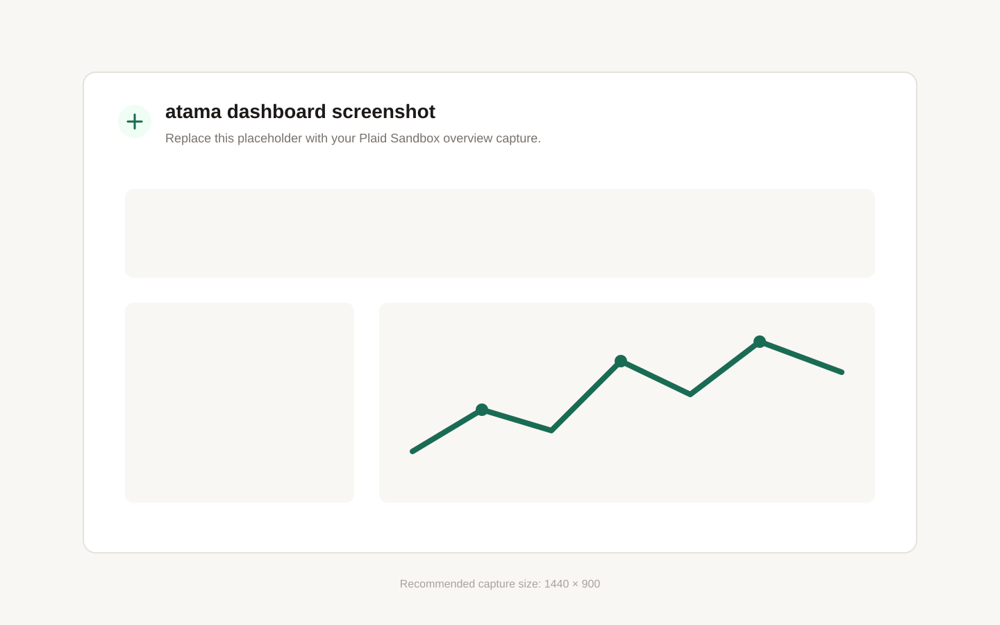
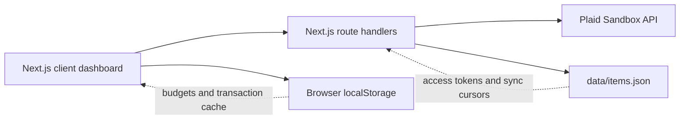

# atama

A calm personal finance dashboard that brings connected bank accounts, transactions, cash flow, and budgets into one view. Atama uses Plaid Sandbox for financial data and keeps the experience intentionally focused on understanding where money is going.



> Replace the placeholder above with a Plaid Sandbox screenshot when preparing the portfolio. A 1440 × 900 overview capture works well and contains no real financial information.

## Features

- Connect and disconnect multiple Plaid Sandbox institutions
- Aggregate balances across checking, savings, credit, and investment accounts
- Synchronize and search transactions across institutions
- Explore category-based spending and monthly cash flow charts
- Create budgets and assign individual transactions to them
- Retain budgets and the latest transaction view in local browser storage
- Recover gracefully from unavailable credentials, Plaid errors, and empty data states

## How it works



Plaid credentials and access tokens remain server-side. Route handlers exchange Link tokens, fetch accounts, synchronize transactions, and remove connected Items. The browser owns interactive dashboard state and local-only budget persistence.

## Tech stack

- Next.js 16 App Router and React 19
- Plaid Node SDK and React Plaid Link
- Recharts for spending and cash-flow visualization
- Tailwind CSS 4
- Vitest, jsdom, and React Testing Library

## Local setup

### Prerequisites

- Node.js 22 (the repository includes a `mise.toml` tool definition)
- pnpm
- Plaid Sandbox client ID and secret

### Install and configure

```bash
pnpm install
cp .env.example .env.local
```

Add the Sandbox credentials from the [Plaid dashboard](https://dashboard.plaid.com/team/keys) to `.env.local`:

```dotenv
PLAID_CLIENT_ID=your_client_id
PLAID_SECRET=your_sandbox_secret
PLAID_ENV=sandbox
```

Start the application:

```bash
pnpm dev
```

Open [http://localhost:3000](http://localhost:3000), select **Connect a Bank**, and use Plaid’s Sandbox credentials:

- Username: `user_good`
- Password: `pass_good`
- Verification code: `1234`

First Platypus Bank (`ins_109508`) and Tartan Bank (`ins_109509`) are useful test institutions.

## Quality checks

```bash
pnpm lint
pnpm test
pnpm build
```

The focused test suite covers transaction merging and search, category and cash-flow calculations, budget totals and validation, plus the primary empty and error states.

## Current limitations

This repository is a local, Sandbox-only portfolio MVP. It does not yet include authentication or a production database. Plaid access tokens and sync cursors are stored in the ignored `data/items.json` file, while budgets and cached transactions use browser `localStorage`. Do not use the current storage model with real financial data.

The transaction sync endpoint currently returns newly added transactions and relies on the browser cache for previously synchronized history. A production implementation should persist transactions and process Plaid’s added, modified, and removed sync results.

## Roadmap

- Add user authentication and PostgreSQL persistence
- Encrypt Plaid access tokens at rest
- Persist full transaction history and handle Plaid webhooks
- Add monthly budget periods and category-based allocation
- Detect recurring expenses and summarize month-over-month changes
